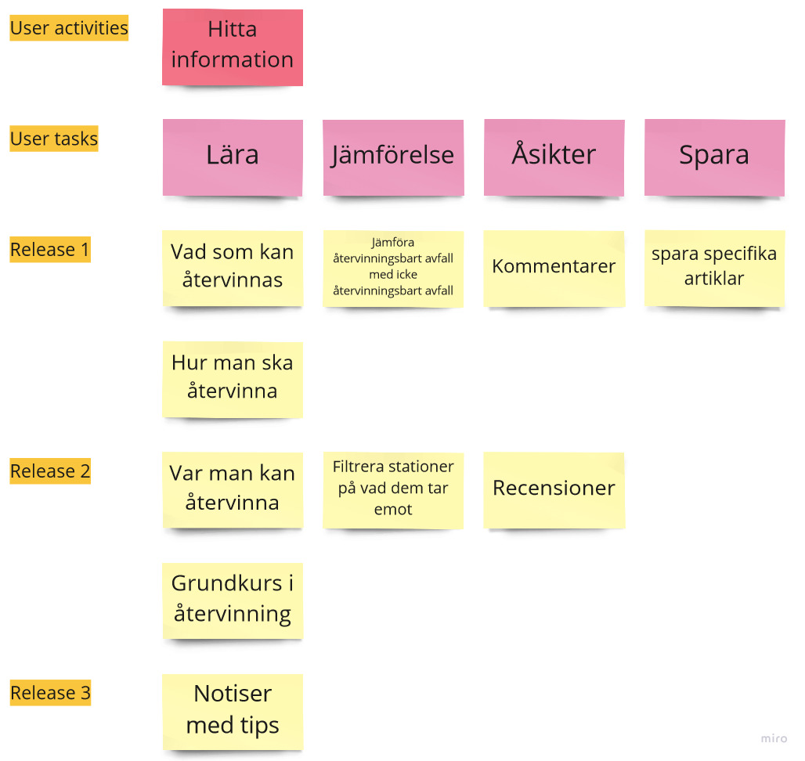

# Problemet

Att veta hur, vad och var man återvinner.

# Lösningen

### Varför bygger vi lösningen?

För att underlätta sökningen efter information om återvinning, för att uppmuntra fler att börja återvinna.

### Vad vill vi uppnå?

En ökad mängd människor som återvinner.

### Vad har lösningen för kunder och användare?

Människor som är intresserade av minska sitt klimatavtryck.

### Vad kan vi kortfattat säga om varje typ av kund eller användare?

Att dem har en önskan att återvinna men inte har tillräcklig kunskap själva.

### Vilka fördelar ger produkten?

Underlättar sökningen efter information om hur, vad och var man återvinner.

### Vilka problem löser produkten?

Felaktig och/eller avstånd från återvinning.

# User stories

-   Som en användare vill jag se vart jag närmast kan återvinna så att jag kan planera min resväg.

-   Som en användare vill jag lära mig hur jag återvinner mina sopor så att jag kan bättre skydda miljön.

-   Som en användare vill jag veta vilka sopor som går att återvinna så att jag kan minska mitt hushållsavfall.

-   Som en nyligen självständig individ vill jag lära mig grunderna om sortering och återvinning så att jag återvinner korrekt.

-   Som en hyresgäst vill jag enkelt se vad som kan och inte kan återvinnas så att jag kan följa min hyresvärds regler.

-   Som en upptagen användare vill jag att systemet ska skicka ut notiser med tips på hur jag kan återvinna så att jag alltid blir påmind om hur viktigt det är.

-   Som en användare vill jag kunna spara specifika artiklar så att jag lätt kan hitta och läsa dem igen.

-   Som en kunnig användare vill jag kunna lämna kommentarer så att jag kan dela med mig av min kunskap.

-   Som en oppionerad användare vill jag läsa och lämna recensioner på återvinningsstationer så att man kan välja en som passar en bättre.

-   Som en användare vill jag kunna filtrera återvinningsstationer på vad jag kan lämna där så att jag inte åker till en station där jag inte kan lämna mitt avfall.

# User story map

